# KnowHub — Architecture Plan

> **Audience**: Engineering teams, product owners, tech leads, and enterprise stakeholders.
> **Diagram format**: All diagrams use Mermaid syntax and render in GitHub, VS Code, and most modern Markdown viewers.

---

## Executive Summary

KnowHub is a multi-tenant, enterprise knowledge-sharing and webinar platform designed to replace ad-hoc knowledge exchange with a governed, searchable, gamified, and AI-augmented system. It allows employees to propose, approve, schedule, attend, rate, and archive knowledge sessions while building contributor profiles, learning paths, communities, and mentor/mentee relationships.

The system is architected around three delivery phases:
- **Phase 1** — Core platform: proposals, approvals, sessions, RBAC, notifications
- **Phase 2** — Content, engagement & learning: XP, badges, leaderboards, learning paths, quizzes, communities, mentoring, knowledge assets
- **Phase 3** — Intelligence, scale & governance: AI recommendations, analytics dashboard, enterprise integrations (Teams, Zoom, Slack, Outlook), speaker marketplace, moderation

The backend follows **Clean Architecture** (.NET 10), the frontend is a **React 18 SPA** (Vite + TypeScript), and data is persisted in **PostgreSQL 16** with multi-tenant data isolation enforced at every query via `TenantId`.

---

## System Context

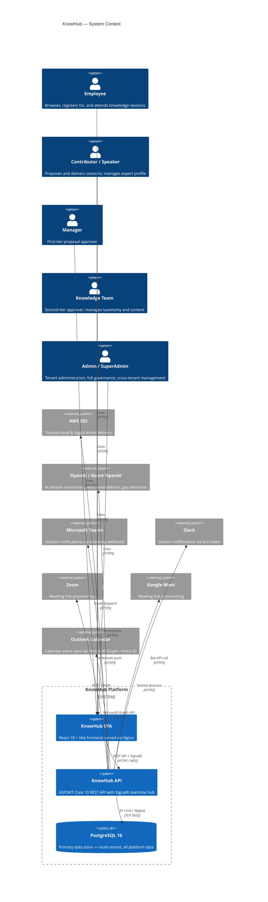

### Overview
The system context shows KnowHub as a bounded platform with five distinct user roles interacting through a single-page application. The API layer is the sole integration point to both the database and all external third-party services.

### Key Components
- **KnowHub SPA** — React 18 delivered by Nginx; communicates with the API over HTTPS and maintains real-time connections via SignalR WebSockets
- **KnowHub API** — stateless ASP.NET Core application processing all business logic; horizontally scalable
- **PostgreSQL 16** — single source of truth with strict `TenantId` partitioning and `RecordVersion` optimistic concurrency
- **AWS SES** — handles transactional email (proposal approvals, session reminders) and the weekly personalised digest
- **OpenAI / Azure OpenAI** — pluggable AI provider for session summaries, personalised recommendations, and knowledge-gap detection (Phase 3)
- **Enterprise integrations** — all implemented behind stub interfaces, toggled via feature flags in `appsettings.json`

### Design Decisions
- All external integrations are **stub-first**: feature flags (`Enabled: false`) keep them safely off in development while the integration interfaces are already wired
- Multi-tenancy is enforced at the **data layer** (every query filters on `TenantId`) rather than at the network layer, enabling a shared-schema SaaS model
- SignalR is used for notifications rather than polling, reducing frontend request noise

---

## Architecture Overview

KnowHub applies **Clean Architecture** (also called Ports & Adapters or Onion Architecture) with a strict inward dependency rule:

```
Domain ← Application ← Infrastructure ← API
```

| Layer | Assembly | Responsibility |
|---|---|---|
| Domain | `KnowHub.Domain` | Entities, enums, domain exceptions — zero external dependencies |
| Application | `KnowHub.Application` | Service interfaces (ports), DTOs, validators, use-case contracts |
| Infrastructure | `KnowHub.Infrastructure` | EF Core, service implementations, email, AI, integrations, background jobs |
| API | `KnowHub.Api` | Controllers, middleware, DI wiring, JWT auth, SignalR hubs, rate limiting |

**Key patterns employed:**
- **Repository-like service pattern** — `IXxxService` interfaces in Application; implementations in Infrastructure
- **FluentValidation** — all input DTOs validated before reaching service logic
- **Optimistic concurrency** — `RecordVersion` on every table; checked on update
- **CQRS-ready** — MediatR wired for Phase 2+ command/query dispatch
- **JWT + Refresh Tokens** — stateless auth; roles stored as `[Flags]` integers
- **SignalR hubs** — real-time notification delivery

---

## Component Architecture

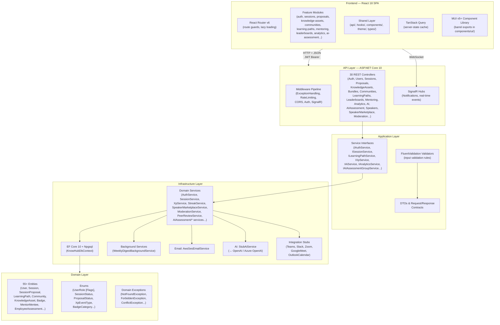

### Key Components

| Component | Purpose |
|---|---|
| **Feature Modules** (20+) | Each feature folder contains page, list, detail, form and dialog components co-located by domain. No cross-feature imports. |
| **Shared API layer** | All Axios calls centralised in `shared/api/`. Feature components never call Axios directly. |
| **TanStack Query** | Server-state cache, mutation tracking, background refetch. All queries keyed by entity + filter. |
| **MUI Barrel** | `components/ui/index.ts` re-exports all MUI components. Features import only from `@/components/ui`, never from `@mui/material` directly. |
| **30 REST Controllers** | Thin; delegate immediately to `IXxxService`. No business logic in controllers. |
| **FluentValidation** | Registered via DI; controllers receive validated models through ASP.NET Core model validation pipeline. |
| **KnowHubDbContext** | Single EF Core DbContext with 55+ `DbSet<T>` properties. All tables include `TenantId`, `RecordVersion`, audit columns. |
| **StubAiService / Stub Integrations** | Concrete stub classes that log or no-op; toggled live by replacing registration or enabling feature flag. Prevents integration failures before keys are provisioned. |
| **WeeklyDigestBackgroundService** | `IHostedService` running on a schedule; queries personalised digest data and dispatches via `IEmailService`. |
| **SignalR Hubs** | Push notifications for proposal status changes, session reminders, badge awards, new comments. |
| **AI Assessment Module** | Independent sub-domain (Groups, Periods, RatingScales, Rubrices, ParameterMaster, EmployeeAssessments, AuditLogs) supporting performance review workflows. |

### Relationships & Communication Patterns
- Frontend → API: REST over HTTPS, JWT Bearer in `Authorization` header
- Frontend → Hubs: WebSocket (SignalR) for real-time push
- Controllers → Services: constructor-injected `IXxxService`; all methods `async`/`await`
- Services → DbContext: EF Core LINQ with explicit `Include()` chains; no raw SQL except via `FromSqlRaw` in analytics
- Services → External: interface-abstracted; stub vs real toggled at DI registration

---

## Deployment Architecture

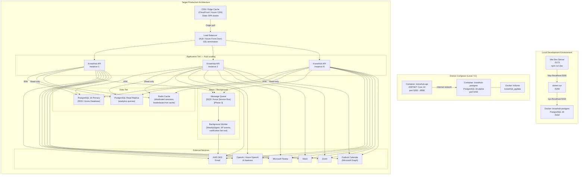

### Overview
Three deployment contexts exist: developer workstation (Vite + dotnet run), Docker Compose (full local or CI stack), and the target production topology.

### Key Components

| Component | Dev | Docker | Production |
|---|---|---|---|
| Frontend | Vite dev server :5173 | Built into API image or separate Nginx container | CDN-fronted static assets |
| API | `dotnet run` :5200 | `knowhub-api` container :5200→8080 | Auto-scaling container replicas behind ALB |
| Database | Docker postgres :5432 | `knowhub-postgres` container | Managed PostgreSQL (RDS / Azure Database) with read replica |
| Cache | In-process `IMemoryCache` | In-process | Redis (distributed) |
| Background Jobs | In-process `IHostedService` | In-process | Dedicated background worker container |

### Design Decisions
- **Stateless API**: No session state in memory; JWT carries identity. Any instance can serve any request — prerequisite for horizontal scaling
- **Read replica**: Analytics and leaderboard queries routed to read replica to protect write-path latency
- **Redis**: Distributed cache for leaderboard hot data and refresh-token blacklisting in production
- **Background worker separation**: In production, `WeeklyDigestBackgroundService` and XP fan-out moved to a dedicated worker process to avoid competing with API request threads

### NFR Considerations
- **Scalability**: Stateless API allows horizontal pod autoscaling (HPA in Kubernetes or ECS task scaling)
- **Security**: SSL at load balancer; secrets injected via environment variables (never in image); DB credentials via secrets manager
- **Reliability**: ALB health checks remove unhealthy instances; PostgreSQL replicas allow failover; volumes on EBS/Azure Disk survive restarts

---

## Data Flow

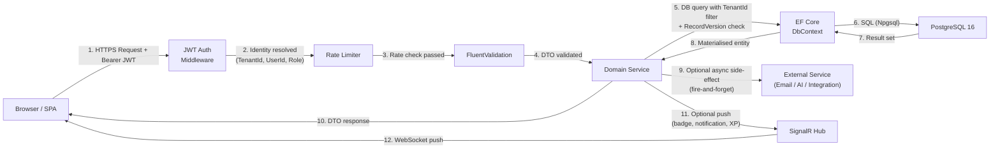

### Overview
This diagram traces the lifecycle of a mutating request (e.g., submitting a session proposal or completing a quiz) from browser to database and back, including the side-effect fan-out path.

### Key Data Stores

| Store | Data | Access Pattern |
|---|---|---|
| PostgreSQL — `SessionProposals` | Proposals in workflow | Insert on submit; select with status filter; update on approval step |
| PostgreSQL — `Sessions` | Scheduled events | Insert from approved proposal; query by category/tag/department |
| PostgreSQL — `UserXpEvent` | Immutable XP ledger | Append-only inserts; `SUM(XpAmount)` aggregations |
| PostgreSQL — `LeaderboardSnapshot` | Historical ranks (JSONB) | Monthly snapshot writes; reads for historical reports |
| PostgreSQL — `KnowledgeAssets` | Post-session artefacts | Insert on upload; full-text search (Phase 3: AI embeddings) |
| In-process Cache | Taxonomy (categories, tags) | Read-through; invalidated on admin writes |
| Redis (Phase 3) | Leaderboard top-N, refresh-token blacklist | Hot read; TTL-driven expiry |

### Data Validation and Processing Points
1. **HTTP layer** — CORS, JWT bearer validation, rate limit
2. **Controller** — model binding; `[ApiController]` auto-returns 400 on binding failures
3. **FluentValidation** — business rule validation (field lengths, enum ranges, cross-field rules)
4. **Service layer** — domain invariant checks (e.g., `RecordVersion` match, role-gated operations, status machine transitions)
5. **EF Core** — `TenantId` filter applied in every query; `SaveChangesAsync` triggers optimistic concurrency check
6. **PostgreSQL** — unique constraints, FK integrity, check constraints (e.g., `SessionScore` 1–5)

### NFR Considerations
- **Security**: `TenantId` is resolved from the JWT claim — never from the request body — preventing cross-tenant data access
- **Performance**: EF Core `AsNoTracking()` used on all read-only queries; projections via `Select` for list endpoints to avoid loading unused columns
- **Integrity**: Append-only `UserXpEvent` ledger ensures XP cannot be retroactively modified; balances computed from `SUM`

---

## Key Workflows (Sequence Diagrams)

### Workflow 1 — Session Proposal to Scheduled Session

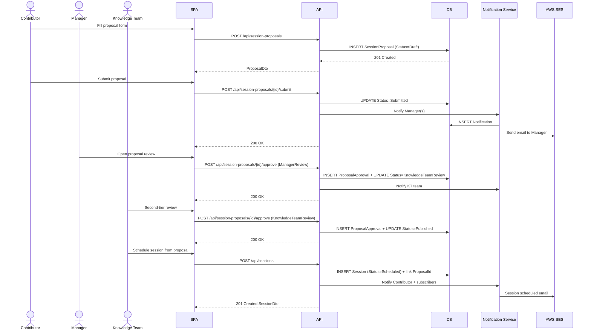

### Workflow 2 — Session Attendance & Post-Session Gamification

```mermaid
sequenceDiagram
    actor Participant
    actor Admin
    participant SPA
    participant API
    participant DB
    participant XpSvc as XP Service
    participant StreakSvc as Streak Service
    participant BadgeSvc as Badge/Notification
    participant Hub as SignalR Hub

    Participant->>SPA: Register for session
    SPA->>API: POST /api/sessions/{id}/register
    API->>DB: INSERT SessionRegistration (Status=Registered)
    API-->>SPA: 200 OK

    Note over Admin,API: Session day — Admin marks complete
    Admin->>SPA: Mark session as Completed
    SPA->>API: POST /api/sessions/{id}/complete
    API->>DB: UPDATE Session Status=Completed
    API->>DB: UPDATE Registrations → Status=Attended
    API-->>SPA: 200 OK

    Participant->>SPA: Submit session rating
    SPA->>API: POST /api/sessions/{id}/ratings
    API->>DB: INSERT SessionRating
    API->>XpSvc: Award XP (AttendSession event)
    XpSvc->>DB: INSERT UserXpEvent
    API->>StreakSvc: Update learning streak
    StreakSvc->>DB: UPDATE UserLearningStreak
    API->>BadgeSvc: Check badge unlock conditions
    BadgeSvc->>DB: INSERT UserBadge (if criteria met)
    BadgeSvc->>Hub: Push badge notification
    Hub-->>Participant: WebSocket: badge unlocked
    API-->>SPA: 200 OK
```

### Workflow 3 — AI Assessment Lifecycle

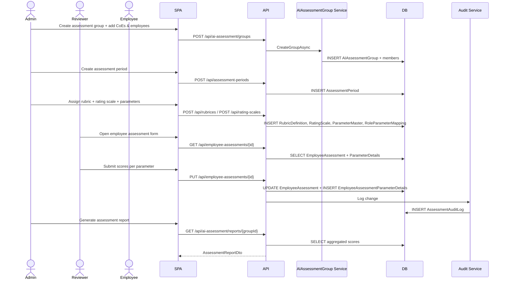

### Explanation
- **Workflow 1** illustrates the core multi-step approval state machine — Draft → Submitted → ManagerReview → KnowledgeTeamReview → Published → Scheduled
- **Workflow 2** shows the gamification fan-out: every post-session action triggers XP, streak, badge, and SignalR push in a chained async pipeline
- **Workflow 3** covers the independent AI Assessment module supporting structured 360-style performance reviews decoupled from the knowledge-sharing domain

---

## Entity Relationship Diagram (Core Domain)

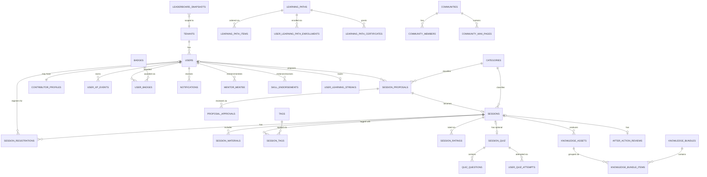

### Overview
The ERD captures the core relationships across the five aggregate clusters: Session/Proposal lifecycle, User/Contributor profile, Learning, Community, and Gamification. All tables have `TenantId` for multi-tenant isolation.

### Design Decisions
- `UserXpEvent` is **append-only** — no updates or deletes; XP balance is always the `SUM(XpAmount)` — this guarantees auditability
- `LeaderboardSnapshot` stores entries as **JSONB** — decoupled from live user data, preserving historical rank integrity even if user profiles change
- `SessionQuiz` has a **unique FK** to `Session` (one quiz per session max) — enforced at both EF and database constraint level
- `CommunityWikiPage` has a self-referencing `ParentPageId` enabling **hierarchical wiki trees** without a separate tree structure table

---

## State Diagrams

### Session Proposal Status Machine

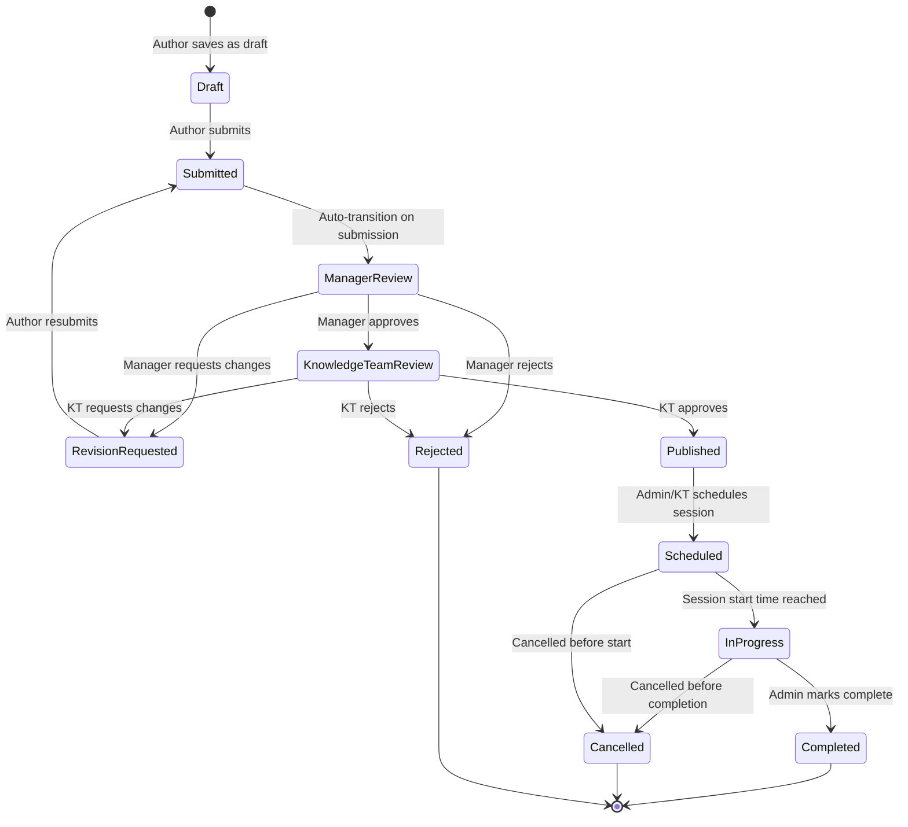

### Session Registration Status Machine

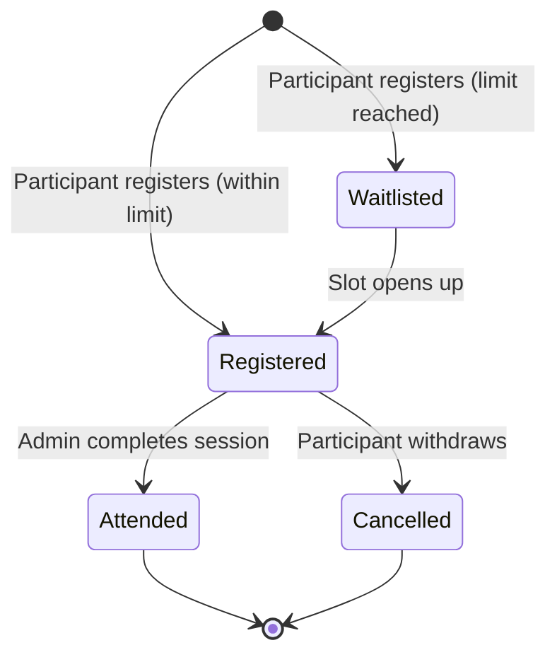

---

## Phased Development

### Phase 1: Core Platform (MVP)

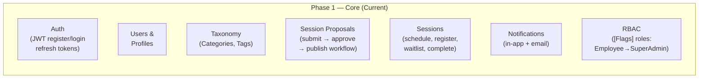

**MVP scope**: A user can register, propose a session, get it approved, schedule it, and have employees register and attend. Basic in-app and email notifications on state changes. Six roles with flag-based permissions enforce governance.

### Phase 2: Content, Engagement & Learning

```mermaid
graph LR
    subgraph Phase2["Phase 2 — Engagement (Current + Active)"]
        KA["Knowledge Assets\n(recordings, slides,\ncode, FAQs)"]
        Bundles["Knowledge Bundles\n(curated collections)"]
        LP["Learning Paths\n(ordered sequences\n+ certificates)"]
        Quiz["Session Quizzes\n(MCQ, T/F, short text\nauto-graded)"]
        XP["XP Engine\n(append-only ledger,\n13 event types)"]
        Badges["Badges & Gamification\n(7 categories,\nXP grants)"]
        LB["Leaderboards\n(6 dimensions,\nmonthly snapshots)"]
        Mentoring["Mentor/Mentee\n(pairing, lifecycle)"]
        Communities["Communities\n(wiki pages, members,\nroles)"]
        Endorsements["Skill Endorsements\n(session-validated)"]
        Streaks["Learning Streaks\n(daily tracking,\nmilestones)"]
        AAR["After-Action Reviews\n(speaker reflection)"]
    end
```

**Phase 2 additions** are all additive — no Phase 1 refactoring required. Each feature appends new tables and new service registrations.

### Phase 3: Intelligence, Scale & Governance

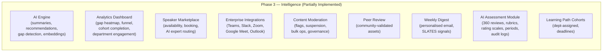

**Phase 3 stub pattern**: All integration services are registered as stubs (`StubTeamsNotificationService`, `StubAiService`, etc.) and toggle to live implementations by swapping a single DI registration or enabling a feature flag.

### Migration Path

| Step | From Phase 1 | To Phase 2/3 |
|---|---|---|
| XP Engine | None | Add `UserXpEvent` ledger; inject `IXpService` calls after key user actions (attend, deliver, upload) |
| Learning Paths | Sessions exist | Add `LearningPath`, `LearningPathItem` linking to existing `Session` and `KnowledgeAsset` entities |
| AI | `StubAiService` returning empty results | Replace DI registration with `OpenAiService`; configure API key in secrets manager |
| Integrations | All stubs | Toggle `Enabled: true` in `appsettings.json`; provision credentials; smoke test |
| Analytics | None | `AnalyticsService` already implemented; expose dashboards in frontend `analytics/` feature module |
| Redis | `IMemoryCache` | Replace `AddMemoryCache()` with `AddStackExchangeRedisCache()`; no service code changes needed |
| Background Queue | In-process `IHostedService` | Extract to dedicated worker; route through SQS/Service Bus; no business logic change |

---

## Non-Functional Requirements Analysis

### Scalability

| Concern | Current | Target |
|---|---|---|
| API instances | Single process | Stateless → horizontal scaling; HPA in Kubernetes |
| Database reads | Single PostgreSQL | Read replica for analytics + leaderboard queries |
| Cache | In-process `IMemoryCache` | Redis cluster for shared state across pods |
| Background jobs | Embedded `IHostedService` | Separate worker container with queue-based fan-out |
| Sessions/users per tenant | Bounded by single Postgres | Partitioned tables or sharding by TenantId for very large tenants (Phase 4 consideration) |

**Design choice**: The `TenantId`-on-every-table approach supports shared-schema multi-tenancy today; if a tenant grows to millions of rows, row-level partition pruning (PostgreSQL declarative partitioning on `TenantId`) can be applied without a schema refactor.

### Performance

- **List endpoints** use `AsNoTracking()` + `Select` projections — avoids loading unused navigation properties
- **Pagination** is standard on all list endpoints — no unbounded result sets
- **`UserXpEvent` balance** computed as `SUM(XpAmount)` — for high-volume users, a materialised view or periodic snapshot can replace the live aggregation
- **Leaderboard snapshots** are pre-computed monthly — leaderboard reads are `O(1)` JSON deserialise rather than live ranking queries
- **Tag usage counts** (`Tags.UsageCount`) are incrementally updated on tag assignment — avoids full count scans
- **SignalR** notification push is fire-and-forget on the API thread — does not block the HTTP response

### Security

| Control | Implementation |
|---|---|
| Authentication | JWT Bearer; `MapInboundClaims = false` to prevent claim remapping |
| Authorisation | Role-based `[Authorize(Roles = "...")]`; `IsAdminOrAbove` helper covers Admin + SuperAdmin |
| Multi-tenant isolation | `TenantId` resolved from JWT claim only — never from request body |
| Optimistic concurrency | `RecordVersion` on every table prevents lost-update race conditions |
| Rate limiting | ASP.NET Core built-in rate limiter on API |
| Input validation | FluentValidation on all request DTOs; `[ApiController]` auto-rejects malformed input |
| Secrets | Credentials injected via environment variables / secrets manager — never hardcoded in images |
| SQL injection | EF Core parameterised queries; `FromSqlRaw` only used for analytics with no user-supplied fragments |
| CORS | Explicit allow-list (`FrontendOrigin` config) — no wildcard in production |
| XSS | React renders all user content as text nodes by default; MUI components escape output |

### Reliability

| Mechanism | Detail |
|---|---|
| Health endpoint | `GET /health` — used by Docker Compose, ALB, and Kubernetes liveness probes |
| Graceful shutdown | ASP.NET Core handles `SIGTERM`; in-flight requests complete before process exits |
| Optimistic concurrency | Prevents silent overwrites; client receives conflict error and can re-fetch |
| DB connection pooling | Npgsql pool manages connections; resilient to transient drops |
| Docker restart policy | `restart: unless-stopped` in Compose; maps to `Always` in Kubernetes deployments |
| Append-only XP ledger | No UPDATE/DELETE on `UserXpEvent` — prevents data loss from buggy update code |
| Email retry | AWS SES SDK includes built-in retry with exponential backoff |

### Maintainability

- **Clean Architecture** enforces a hard dependency rule at the assembly reference level — infrastructure details can never leak into domain logic
- **FluentValidation** keeps validation rules in dedicated `Validator` classes — testable in isolation
- **Feature folder structure** in frontend (`features/xxx/`) means all files for one feature are co-located — a developer new to one feature does not need to navigate across the whole codebase
- **Stub-first integrations** allow new engineers to run the full system locally without any external credentials
- **`RecordVersion`** and audit columns (`CreatedBy`, `ModifiedBy`, `ModifiedOn`) on every table provide a built-in audit trail without additional instrumentation
- **UI barrel pattern** (`components/ui/index.ts`) creates a single choke-point for MUI — upgrading MUI or swapping out a component requires changes in one file, not across dozens of feature files

---

## Risks and Mitigations

| Risk | Likelihood | Impact | Mitigation |
|---|---|---|---|
| XP ledger performance at scale | Medium | High | Pre-aggregate `UserXpBalance` column updated on each `UserXpEvent` insert; or use a materialised view refreshed periodically |
| JWT secret rotation | Low | Critical | Secrets manager rotation with rolling key support; multiple valid `IssuerSigningKey` entries during transition window |
| AI API key exposure | Medium | High | Keys stored in secrets manager (AWS Secrets Manager / Azure Key Vault); never in repo or Docker images |
| PostgreSQL single-point write bottleneck | Low (early stage) | High | Read replica separates analytics load; connection pooling (PgBouncer) for burst traffic; partitioning as growth demands |
| `TenantId` misconfiguration allowing cross-tenant read | Low | Critical | `ICurrentUserAccessor.TenantId` resolved exclusively from validated JWT — code review policy; integration test coverage for cross-tenant isolation |
| Integration stub in production | Medium | Medium | CI gate: environment-specific configuration validation on startup; `Enabled: true` in prod config triggers startup check for credential presence |
| EF migration drift | Medium | Medium | Migrations versioned in source control (001–005 already committed); migration idempotency enforced; never modify already-applied migrations |
| SignalR connection storm on broadcast | Medium | Medium | Group-scoped hub messages (per tenant per topic) rather than global broadcast; backplane (Redis) in production |
| Weekly digest timeout | Low | Medium | Paginated processing in background service; per-user email dispatched serially with delay; move to SQS for fan-out parallelism in Phase 3 |

---

## Technology Stack Recommendations

| Layer | Current / Chosen | Justification |
|---|---|---|
| **Backend runtime** | .NET 10 / ASP.NET Core | Long-term support; high-performance Kestrel; first-class async; excellent EF Core integration |
| **ORM** | EF Core 10 + Npgsql | Type-safe queries; migration tooling; JSONB support for snapshots and MCQ options |
| **Database** | PostgreSQL 16 | ACID compliance; JSONB for flexible columns; excellent .NET driver; mature managed offering on AWS/Azure |
| **Frontend framework** | React 18 + Vite + TypeScript | Fast HMR; strict typing; largest ecosystem; concurrent rendering for rich interactive UIs |
| **UI component library** | MUI v5+ | Enterprise-grade, accessible, well-documented; barrel export pattern enforces design consistency |
| **Server-state cache** | TanStack Query | Declarative; auto-refetch; mutation tracking; stale-while-revalidate |
| **Form management** | React Hook Form + Zod | Minimal re-renders; schema-driven validation; excellent TypeScript inference |
| **Real-time** | SignalR (ASP.NET Core) | Native .NET integration; automatic transport fallback (WebSocket → SSE → long-poll) |
| **Email** | AWS SES | High deliverability; cost-effective at scale; SDK retry built-in |
| **AI** | OpenAI / Azure OpenAI (pluggable) | Provider-agnostic interface allows switching without code changes; Azure OpenAI for data-residency compliance |
| **Container runtime** | Docker / Docker Compose | Dev/prod parity; Postgres and API in same network; CI-reproducible builds |
| **Target production orchestration** | Kubernetes (EKS / AKS) | HPA for API scaling; managed Postgres for HA; Redis as add-on |
| **Distributed cache (Phase 3)** | Redis | Replace `IMemoryCache`; zero code change to services thanks to `IDistributedCache` abstraction |
| **Message queue (Phase 3)** | AWS SQS / Azure Service Bus | Decouple weekly digest and XP fan-out from request thread; at-least-once delivery |

---

## Next Steps

**Immediate (Phase 1 stabilisation)**
1. Complete frontend feature modules for all Phase 1 routes — matching the 30 implemented API controllers
2. Add TypeScript strict type coverage for all shared API response types
3. Configure production secrets management (AWS Secrets Manager or Azure Key Vault) before first production deploy
4. Establish CI pipeline: build → unit tests → TypeScript check → Docker build

**Short-term (Phase 2 rollout)**
5. Implement leaderboard monthly snapshot cron job (first run of `LeaderboardService.SnapshotAsync`)
6. Replace `IMemoryCache` with Redis for multi-instance deployments
7. Enable `WeeklyDigestBackgroundService` scheduling (currently always-running; configure cron expression)
8. Add integration tests for cross-tenant isolation (critical security gate)

**Medium-term (Phase 3 readiness)**
9. Provision AI API keys; replace `StubAiService` with `OpenAiService`; implement embedding-based semantic search on `KnowledgeAssets`
10. Enable Teams / Slack webhooks; smoke test notification fan-out in staging
11. Extract `WeeklyDigestBackgroundService` to dedicated worker container with SQS queue
12. Add PostgreSQL read replica; route `AnalyticsService` queries to it
13. Implement PgBouncer connection pooler in front of PostgreSQL primary
14. Introduce distributed tracing (OpenTelemetry → Jaeger / Azure Monitor) across API and background workers

**Governance**
15. Document ISO 9001-aligned KM reporting requirements for the analytics dashboard
16. Define data retention policy for `UserXpEvent` (append-only — define archival window)
17. Conduct security review of JWT role flags implementation; pen test the `TenantId` isolation boundary
